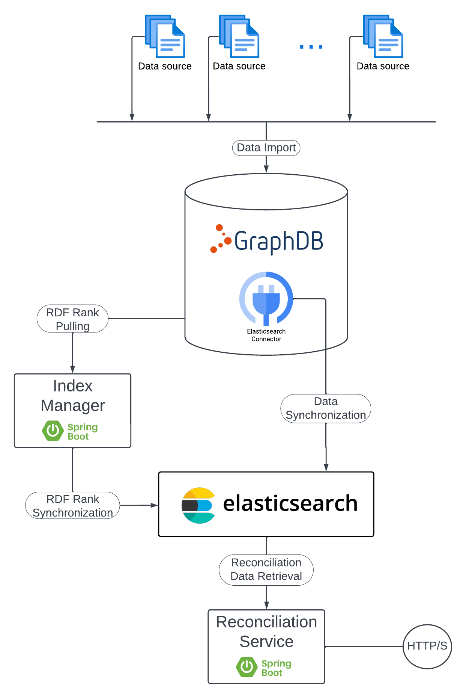
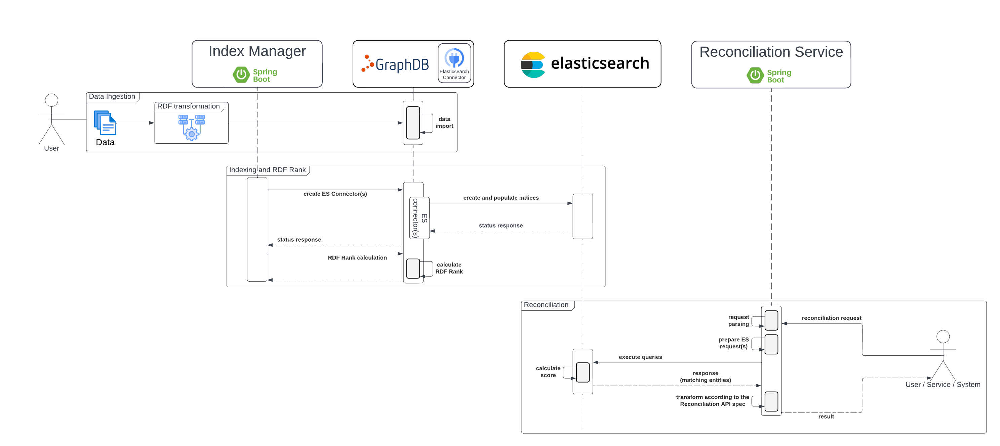

# Ontotext Reconciliation

- [Ontotext Reconciliation](#ontotext-reconciliation)
  - [Overview](#overview)
  - [Architecture and API](#architecture-and-api)
    - [Base Components](#base-components)
    - [Reconciliation](#reconciliation)
      - [Data and Knowledge Graph](#data-and-knowledge-graph)
      - [Reconciliation Process](#reconciliation-process)
      - [Limitations and Known Issues](#limitations-and-known-issues)
    - [API](#api)
  - [Distribution](#distribution)
  - [Public Demonstrators](#public-demonstrators)
  - [LICENSING](#licensing)
  - [Release Notes](#release-notes)
  - [Contact](#contact)
    - [Issues and Discussions](#issues-and-discussions)

## Overview

In our field, the term `data reconciliation` refers to matching of specific (in most cases text) data against entities,
thus allowing the users to integrate data from different sources, which often don't share common unique identifier.

The reconciliation provides a mechanism to create relationships between data in text form and concrete entities stored
within databases. These mechanisms are not limited to text matching only, there are various mechanisms for matching of
entities stored in multiple databases. This is done by matching specific set of their characteristics in order to
determine, whether an entity from a source database is matching an entity from a target database.

However, no matter what kind of matching is performed, nor what are the source and the target, the reconciliation
process is heuristic. Different entities can have many identical characteristics, leading to false positives. The same
entity can be represented in different ways by two databases, for instance by spelling names differently, leading to
false negatives. One of the main goals of the modern reconciliation is to reduce the false positives to a minimum and
keep the agnostic nature of the process, regarding the choose on how the entities are determined as good candidates for
a particular query.

Furthermore, data reconciliation in a real world scenario, always requires some level of human judgement, often on tle
level of individual instances or small groups of similar instances. Ergonomics and UX thus play a major part in
designing the reconciliation tooling and workflow, as they allow to optimize the attention and commitment of the human
in the loop.

The semantics of the reconciliation process are defined in `Reconciliation Service API` specification, which also plays
the role of protocol definition between reconciliation server and client. This helps both sides of the development,
where as a compliant providers of the service can be used by many compliant clients. 

For more information about the Reconciliation Specification, please refer to
[Reconciliation Service API v0.2](https://www.w3.org/community/reports/reconciliation/CG-FINAL-specs-0.2-20230410/).

## Architecture and API

The specification doesn't impose any specific implementation, which leaves the developers/providers to decide on how the
service will be implemented and what additional tools or/and components to be included as part of the system. 

Our implementation requires few components in order to supply the service with rich enough data so that it can provide
the best top result from the available and matched entities.

The below diagram, provides a high level overview of the minimal set of components that the service requires. It also
shows the connection and interaction between the components.



The current architecture allows more components to be added. It relies on the `HTTP` calls between the components and
the core datastore `GraphDB`, which on the other hand, provides various out-of-the-box integrations with tools and
services via connectors.

Keep in mind that both `GraphDB` and `Elasticsearch` are supporting cluster architecture so the system can be scaled.
We recommend to factor in the scalability, when adding additional components to the base architecture.

### Base Components

As shown the in the architecture diagram, the components included in Ontotext Reconciliation are:

- `Reconciliation Service`: the component which implements the `Reconciliation Service API` specification and the entry
  point for the clients. As data suppliers are used `Elasticsearch` indices. The service executes configurable queries
  against these indices in order to gather the candidate entities.

- `GraphDB`: the main datastore. It contains all of the information about the entities. The `Elasticsearch Connector` is
  responsible for data synchronization between `GraphDB` and `Elasticsearch` instances. When an entity is created,
  updated or deleted, the Connector updates the indices in `Elasticsearch` in the same transaction so that the data is
  kept consistent at all times.

- `Elasticsearch`: contains data indices. These data is used by the `Reconciliation Service` as source data in the
  matching process. The main reasons for using `Elasticsearch` are the out-of-the-box fuzzy queries, the performance
  benefits regarding the data aggregation and we have quite a bit of experience with the application.
  The data for the indices is coming from the `GraphDB Elasticsearch Connector`(s), which allows us to configure which
  parts of the entities should be included in the an index and which not.
  It is possible to index the entire entities, but the recommendation is to index only the characteristics that are
  needed for the reconciliation process.

- `Index Manager`: simple service, which automates the creation of `GraphDB Elasticsearch Connector`(s), based on the
  provided configurations. It also triggers the (re)calculation of the RDF Rank in `GraphDB`.
  The service isn't essential to the system as all of the operations can be done manually. However, it provides nice
  and streamlined process, which minimizes the risk of an error or misconfiguration for the indices.

### Reconciliation

The reconciliation is handled by the `Reconciliation Service` as it is the service that provides the API. It is a
[Spring Boot](https://spring.io/projects/spring-boot) application, which exposes the different reconciliation
endpoints via REST API.

The application is designed to support and serve multiple reconciliation endpoints, based on the type of the entities
that are reconciled.

#### Data and Knowledge Graph

First, let us speak about the `Knowledge Graph` and the data that will be used for the reconciliation.  
`GraphDB` serves as main datastore, where the data will be stored and conform to specific knowledge model. Having the
in a `Knowledge Graph` allows us to exploit the hierarchy of the data and the relations between the different entities.

We can use data from all kinds of data sources, the only requirements are that it should be transformed into `RDF` and
preferably, conform to specific `Knowledge Graph` so that it can be used in full capacity.  
There are a lot of tools and libraries that can help with the transformation. We recommend using our other free product
[Ontotext Refine](https://platform.ontotext.com/ontorefine/), which provides excellent features for transformation of
`CSV`, `TSV`, `Excel`, `JSON`, `XML` and more file formats to `RDF`, where the mapping between the data formats can be
done, either through visual `RDF Mapping` or via `SPARQL CONSTRUCT` query.  
Furthermore the `Ontotext Refine` is a client of the `Reconciliation API`, which allows the data to be enriched further
by using already available reconciliation endpoints, before adding it to the datastore and the `Knowledge Graph`.

Additionally, for each of the entities in the `GraphDB`, an `RDF Rank` is calculated. It is used as additional
disambiguation criteria, when there are multiple candidates for specific reconciliation requests.

The available data in `GraphDB` is synchronized with `Elasticsearch` via `GraphDB Elasticsearch Connector`(s). The
connectors are configured for specific indices, where the user decides what entities and characteristics should be added
to a specific index.  
These indices are used as data sources for the `Reconciliation Service`, allowing flexibility, when defining specific
reconciliation endpoints, granularity when the data is large and scalability when the performance becomes an issue.

The decision to use `Elasticsearch` indices comes from the fact that they are optimized for various types of queries
and aggregations over the data. Also, there are a lot of tools, which integrate pretty well with `Elasticsearch`.  
It is also possible to setup monitoring and collects statistics for each individual index.

There is another repository [Reconciliation Use Cases](https://github.com/Ontotext-AD/reconciliation-use-cases)
supported by us. It provides data, configurations and instructions for different reconciliation use-cases, which can be
explored or experimented with for further evaluation of the technology.

#### Reconciliation Process

The standard reconciliation process consist of parsing of the request query (or queries), transform it to an
`Elasticsearch` query, which is executed over specific index. When the `Elasticsearch` response is returned, it is
transformed to a structure described in the `Reconciliation Service API` specification and returned to the client/user.

The `Elasticsearch` query depends on the provided template or if there isn't one, the logic will fallback to a default
`term` query.

The query template provides flexibility, what type of query should be used, how it is going to be structured and what
additional matching criteria should be used. Each index, effectively `Reconciliation API` can have different query, thus
allowing various experiments and evaluation processes in order to configure the service for the best possible results.

To include the `RDF Rank` in the scoring logic, a custom function is added to the `Elasticsearch` queries during their
building.



#### Limitations and Known Issues

The current version of the type suggestion API is not quite compliant with the `Reconciliation Service API`
Specification, which states that the service should be able to handle hierarchy of types and build appropriate
responses.

The main issue with our implementation is that we don't store any information about the types hierarchy, when it is
indexed in the `Elasticsearch`, therefore we are not able to construct correct responses.

An additional issue is the data, which may not have type hierarchy at all, but just multiple values for the entities
types.

There are still a lot of unknowns that we need to answer in oder to address properly the above issues.

One potential solution for some of them could be data validation via SHACL or other mechanism and correction of the data
before the actual indexing. However, this requires some redesign in `Elasticsearch`, where we need a solid way to
represent and query the hierarchy.

### API

For the purpose of the examples, we assume that the service is running locally.

As mentioned in the previous section, the service can provide the API over multiple indices. To do that, the index name
is part of the request URL.

**Reconciliation Endpoints**

```bash
# Provides information about all reconciliation endpoints that are accessible from the current service.
# Response: JSON
curl http://localhost:8080/


# Provides information for specific reconciliation endpoint bound to Elasticsearch index.
# Response: JSON (refer the spec for details)
curl http://localhost:8080/{index-name}


# Executes reconciliation request using the provided query.
# Parameters:
#     (required) query - JSON or string
#     (optional) explain - additional boolean parameter that can be used in combination with both query or queries.
#                          Used to provide information about the query execution. Default set to false
# Response: JSON (refer the Spec for details)
curl http://localhost:8080/{index-name}?query=...&explain=true


# Execute multiple reconciliation requests using the provided queries.
# Parameters:
#    (required) queries - JSON or string containing multiple queries.
#    (optional) explain - additional boolean parameter that can be used in combination with both query or queries.
#                         Used to provide information about the query execution. Default set to false
# Response: JSON (refer the Spec for details)
curl http://localhost:8080/{index-name}?queries=...


# Provides suggests for properties containing the provided prefix value.
# Parameters:
#    (required) prefix - term used to match properties in the index
#    (optional) type - multiple string values (not used with Elasticsearch implementation, please consult the Spec for
#                      more details)
#    (optional) typeStrict - string value (not used with Elasticsearch implementation, please consult the Spec for more
#                            details)
#    (optional) limit - the number of results that should be returned
#    (optional) start - basically offset
# Response: JSON (refer the Spec for details)
curl http://localhost:8080/{index-name}/suggest/property?prefix=...


# Provides suggests for entity names containing the provided prefix value.
# Parameters:
#    (required) prefix - term used to match entity in the index
#    (optional) type - multiple string values (consult the Spec for more details)
#    (optional) typeStrict - string value (consult the Spec for more details)
#    (optional) limit - the number of results that should be returned
#    (optional) start - basically offset
# Response: JSON (refer the Spec for details)
curl http://localhost:8080/{index-name}/suggest/entity?prefix=...


# Provides suggests for type names containing the provided prefix value.
# Parameters:
#    (required) prefix - term used to match types in the index
#    (optional) type - multiple string values (consult the Spec for more details)
#    (optional) typeStrict - string value (consult the Spec for more details)
#    (optional) limit - the number of results that should be returned
#    (optional) start - basically offset
# Response: JSON (refer the Spec for details)
curl http://localhost:8080/{index-name}/suggest/type?prefix=...


# Provides a preview in a form of small HTML document for the specified identifier.
# Parameters:
#    (required) id - the identifier of the object which preview should be generated
# Response: text/html (refer the Spec for details)
curl http://localhost:8080/{index-name}/preview?id=...


# Provides a way to fetch properties on a selection of entities.
# (Consult https://reconciliation-api.github.io/specs/0.1/#data-extension-service)
# Parameters:
#    (required) extend - query used to fetch the values of the properties on the selected entities
# Response: JSON (refer the Spec for details)
curl http://localhost:8080/{index-name}?extend=...


# Note: by specification this endpoint should be '/properties' instead of '/propose_properties'.
#
# Provides fetching mechanism for the properties of specific type.
# Parameters:
#    (optional) type - the type of the entity
#    (optional) limit - the number of results that should be returned
# Response: JSON (refer the Spec for details)
curl http://localhost:8080/{index-name}/propose_properties?type=Human&limit=20
```

**Support Endpoints**

```bash
# Provides information of the current memory usage and limits.
# Response: text/plain
curl http://localhost:8080/debug


# Provides health check information.
# Response: JSON
curl https://localhost:8080/__health


# Provides good-to-go information.
# Response: JSON
curl https://localhost:8080/__gtg


# Provides general service information.
# Response: JSON
curl https://localhost:8080/__about


# Provides service version.
# Response: text/plain
curl https://localhost:8080/version
```

## Distribution

The `Reconciliation Service` and the `Index Manager` are packaged and publicly available as Docker Images. This allows
us to distribute them in few different ways.

To see the currently supported distributions, please check the [distributions](../distributions/) directory.

## Public Demonstrators

Ontotext hosts and provides for free, a couple of Reconciliation endpoints. As entities data source, we are using a
subset of `Wikidata`, in particular the entities about Organizations, People and Locations. The data is synchronized
every day in order to keep the endpoints up-to-date with the actual `Wikidata` dataset.

The endpoints are used as Proof of Concept for our infrastructure and architecture, which give us plenty of data for
evaluation and groundwork for further evolution of the logic and the concept.

The endpoints are available at:

- https://reconcile.ontotext.com/people: matches names of people to entities collected from Wikidata
- https://reconcile.ontotext.com/organizations: matches names of organizations to entities collected from Wikidata
- https://reconcile.ontotext.com/locations: matches names of locations to entities collected from Wikidata

Different entities characteristics can be used in order to increase the score of the candidate entities.

For more details please refer to our blog post:
[KGF 2021 Talks: Reconciliation Server Demonstration Against Wikidata](https://www.ontotext.com/knowledgehub/videos/kgf21-talks-reconciliation-server-demonstration-against-wikidata/)

> **NOTE**: The endpoints provided by Ontotext are currently compliant with **version 0.1** of the
**Reconciliation Service API**.

## LICENSING

TODO: a license file or at least mention how the service is licensed

## Release Notes

Please refer to the [RELEASE-NOTES](../releases/RELEASE-NOTES.md).

## Contact

Please contact us directly via our [Contact Form](https://www.ontotext.com/contact/) or via email:
`reconciliation@ontotext.com`.

### Issues and Discussions

Alternatively, you can submit an [Issue](https://github.com/Ontotext-AD/reconciliation/issues) or open a
[Discussion](https://github.com/Ontotext-AD/reconciliation/discussions).
